# Connector Space reporting tool for MIIS/ILM/FIM/MIM/Azure AD Connect

## About
This is a Visual Studio C# project that provides a GUI for filtering and reporting on data within XML files generated using the csexport.exe utility that is included with MIM/Azure AD Connect.  Reports can be made in HTML (quick and dirty HTML table), CSV, and Excel.

Although not required, it is capable of executing csexport.exe on your behalf if ran on the server where MIM Sync/Azure AD Connect is installed.  It uses Registry Keys to determine the install location in order to locate csexport.exe.  

**NOTE:  csexport.exe is included with Azure AD Connect.**

## Recent Updates

**\~\~Documentation\~\~**
**\~\~Vertical Excel Reports\~\~**

# How-Tos

## Create connector space file
The connector space file is created using the csexport.exe command-line tool included with the Sync Engine installation.  It is typically located in the 'Synchronization Service\Bin' directory under the installation folder.  Azure AD Connect uses a different path.

**Manually create connector space file**

Official documentation for the csexport tool can be found at <https://docs.microsoft.com/en-us/previous-versions/mim/jj590346(v=ws.10)>.  Simple usage examples can be seen by clicking on the 'csexport examples' button as shown below.

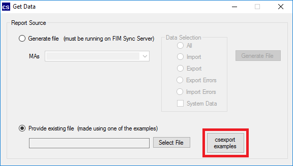
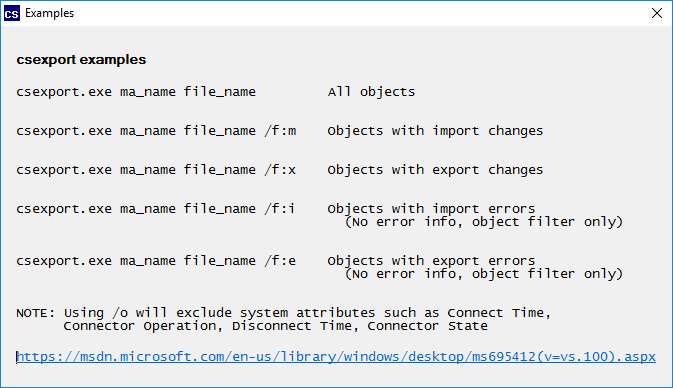

**Automatically generate connector space file**

**NOTE:**  This requires the CSReporter tool to be run on the server where the Sync Engine is installed.  This is detected by using Registry Keys to determine the install location in order to locate csexport.exe.

Select the 'Generate file' option and the name of the management agent to report on from the drop down menu.  In the Data Selection, pick the type of data to include in the export file.  Click 'Generate File' to pick the name\location of the connector space file and launch the csexport.exe tool.

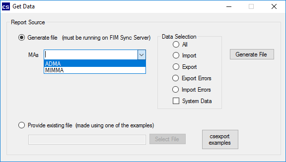
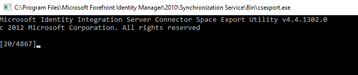

## Filtering

**Filtering works from left (Hologram selection) to right (Attribute value matching).**  Once a file has been selected and parsed, the Filter screen will be shown.

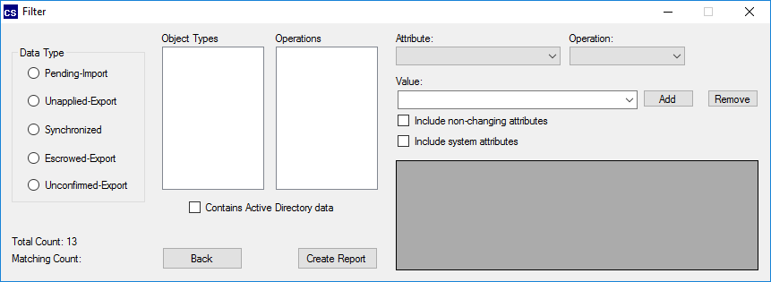

From here select the name of a Hologram and see the 'Object Types' box dynamically display the available types.  Also notice the 'Matching Count' in the bottom left of the screen is updated with the number of objects with the selected hologram.

Once a Hologram is selected, all available filtering options to the right (Object Types, Operations, Attributes) are dynamically updated.  In order for a filtering option to become available, all filtering options to the left must be selected.  For example, the Attributes drop-down isn't populated until Hologram, Object Types, Operations are selected.  Similarly, the Operations box is empty until both Hologram and Object Types are selected.

**NOTE:** The Operations box will not be populated when the Synchronized hologram is selected.  Only the Hologram and Object Types options are required for the Attributes drop down to be populated.

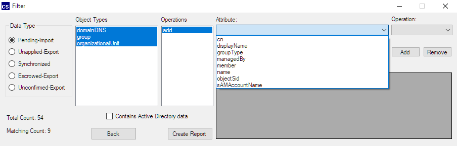

## Reporting

Reports can be generated by clicking on the 'Create Report' button.  The Report Settings screen will appear with options for the type of report to generate.  Select the attributes to include in the report and the report type.  Click OK to select name\path of the report.

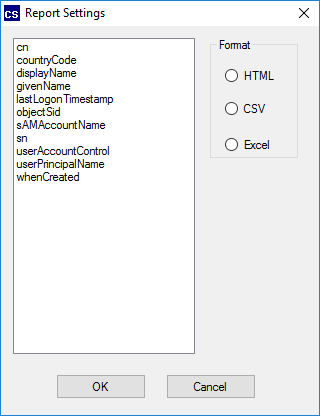

Report Types
- HTML - Quick and dirty table.  Browsers may hang on large reports

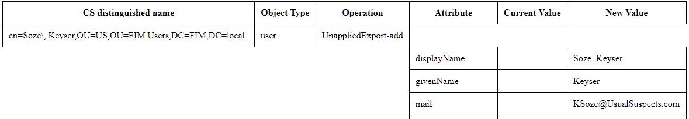

- CSV - Standard comma delemited file made for importing into Excel where additional filtering can be completed

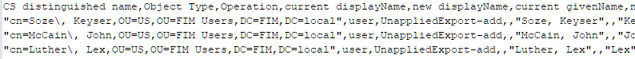

- Excel - Native Excel file that allows for additional filtering
  - Horizontal - A CSV\table-like layout with attributes listed across the top from left to right.
  
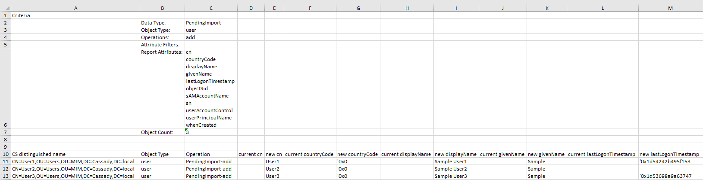
  
  - Vertical - Similar to the HTML table, attributes are listed underneath each anchor from top to bottom
  
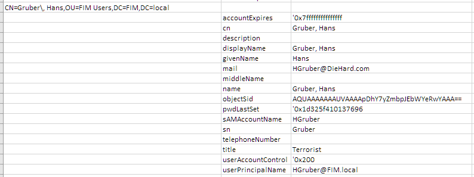

## Advanced Features

**Contains Active Directory data**

This checkbox can be used when the data comes from an Active Directory Management Agent.  It will translate the below AD values into human readable data.  **This can be used for both filtering and reports**

Examples:

- accountExpires
  - 0x7fffffffffffffff to Never
- objectSid
  - AQUAAAAAAAUVAAAApDhY7yZmbpJEbWYeigQAAA== to S-1-5-21-4015536292-2456708646-510029124-1162
- pwdLastSet
  - 0x1d098fc86f51e23 to 5/28/2015 4:12 AM
- groupType
  - 0xffffffff80000002 to -2147483646
- userAccountControl
  - 0x200 to 512
- createTimeStamp
  - 20010928060000.0Z to 9/28/2001 6:00 AM

The below pictures show filtering on the userAccountControl attribute and how the 'Contains Active Directory data' checkbox can be used when filtering.

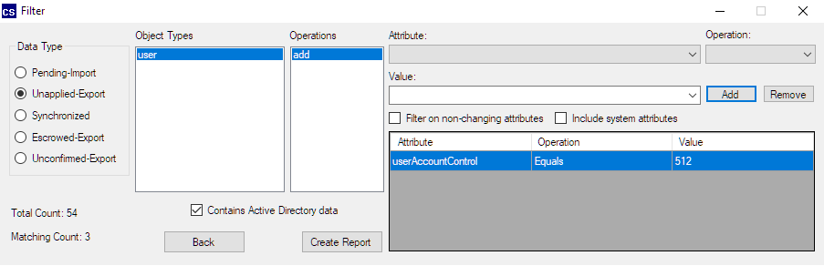

**Filter on non-changing attributes**

The purpose of this is to allow reporting of changes by using an Attribute filter based on Synchronized values.  For example, finding all users with pending import\export changes where a specific Department value is not chaning (i.e. exists only in Sync hologram).
**NOTE: As the warning states, any filters applied at the Attribute level will be applied ONLY to Attributes in the Sync hologram.**

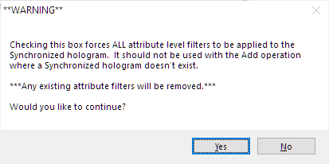

**Include system attributes**

This allows filtering on object meta-data present in the connector space file such as Connector State.

Current supported system attributes
- DN (when not changing)
- Connector State
- Disconnect Time
- Connector Operation
- Connect Time
- Connector
- Export Error Details

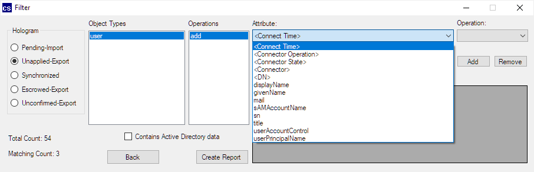

**Note:** The connector space file must contain this meta-data.  If the csexport option /o is used, it will be excluded.  When generating files using CSReporter, the System Data box must be checked on the Get Data form.
**NOTE:** Generating a connector space file with this additional data will be much slower as much more data is written to the XML file.

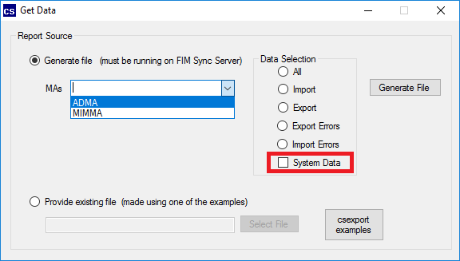

## Large Files
Connector space files generated with csexport will vary in size greating depending on the environment.  I have generated files over 5GB in size (and generated reports using CSReporter).  In the countless hours of development and usage of CSReporter, generally the amount of memory (RAM) required is 2.5-4x the size of the connector space file on disk.  This means that a 300MB file could require upwards of 1.2GB of available memory. Not all systems have this much unused for CSReporter to run.  Thus for files larger than **150MB**, CSReporter does not keep an in-memory representation of the connector space file.

**For files larger than 150MB, each time the filter is adjusted, the file is parsed line by line from disk.**

This allows for CSReporter to support large files, without the need for large amounts of memory.  It allows for CSReporter to be used in more environments, such as Production, without creating memory issues.